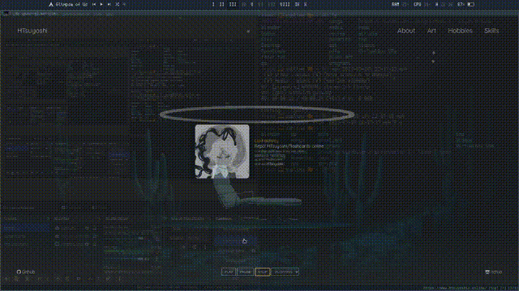

# HTsuyoshi.github.io

My personal webpage to show my hobbies and my CV.

To run inside my docker I use the `_start.sh` script and host to `172.17.0.2` port `80`.

This site uses [anime.js](animejs.com) and the static website generator `jekyll`.

